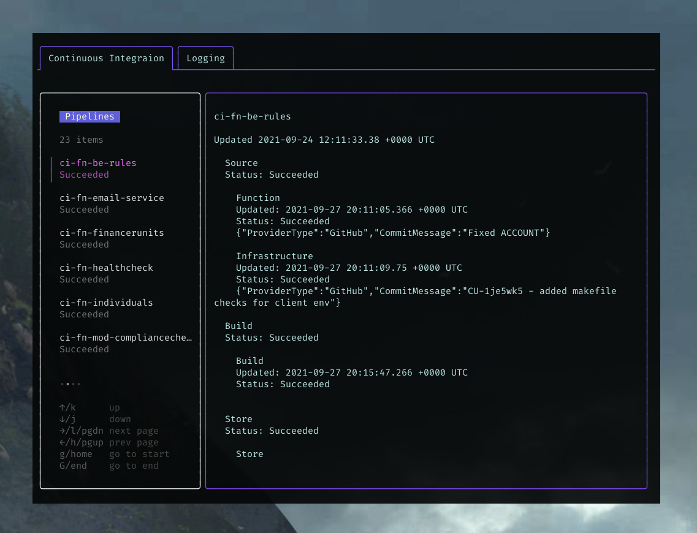
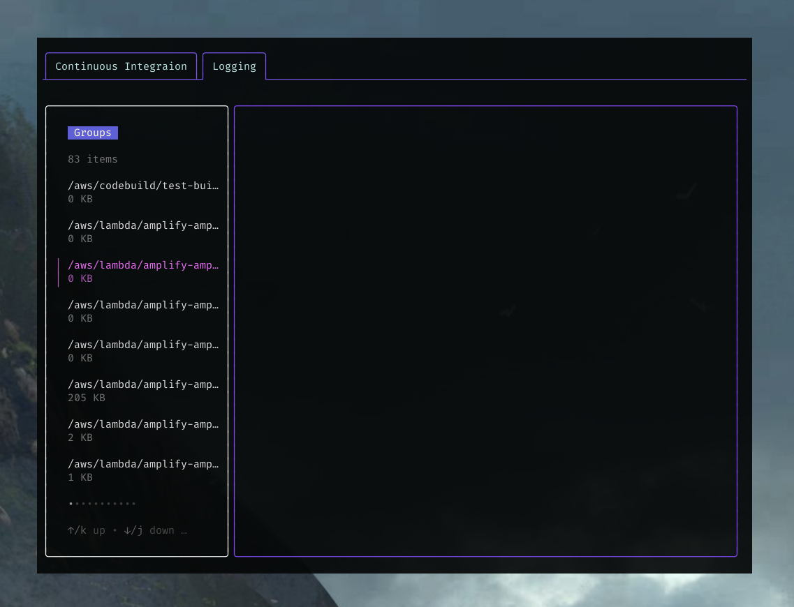

```

                 ===   T H E   C L O U D   A V I A T O R   ===

⠀⠀⠀⠀⠀⠀⠀⠀⢶⣦⣄⠀⠀⠀⠀⠀⠀⠀⠀⠀⠀⠀⠀⠀⠀⠀⠀⠀⠀⠀⠀⠀⠀⠀⠀⠀⠀⠀⠀⠀⠀⠀⠀⠀⠀⠀⠀⠀⠀⠀⠀⠀⠀⠀⠀⠀⠀⠀⠀⠀⠀⠀
⠀⠀⠀⠀⠀⠀⠀⠀⠀⠙⢿⣷⣦⡀⠀⠀⠀⠀⠀⠀⠀⠀⠀⠀⠀⠀⠀⠀⠀⠀⠀⠀⠀⠀⠀⠀⠀⠀⠀⠀⠀⠀⠀⠀⠀⠀⠀⠀⠀⠀⠀⠀⠀⠀⠀⠀⠀⠀⠀⠀⠀⠀
⠀⠀⠀⠀⠀⠀⠀⠀⠀⠀⠀⠙⢻⣿⣷⣤⡀⠀⠀⠀⠀⠀⠀⠀⠀⠀⠀⠀⠀⠀⠀⠀⠀⠀⠀⠀⠀⠀⠀⠀⠀⠀⠀⠀⠀⠀⠀⠀⠀⠀⠀⠀⠀⠀⠀⠀⠀⠀⠀⠀⠀⠀
⠀⠀⠀⠀⠀⠀⠀⠀⠀⠀⠀⠀⠀⠈⠻⣿⣿⣶⣄⠀⠀⠀⠀⠀⠀⠀⠀⠀⠀⠀⠀⠀⠀⠀⠀⠀⠀⠀⠀⠀⠀⠀⠀⠀⠀⠀⠀⠀⠀⠀⠀⠀⠀⠀⠀⠀⠀⠀⠀⠀⠀⠀
⠀⠀⠀⠀⠀⠀⠀⠀⠀⠀⠀⠀⠀⠀⠀⠈⠻⣿⣿⣿⣦⣄⠀⠀⠀⠀⠀⠀⠀⠀⠀⠀⠀⠀⠀⠀⠀⠀⠀⠀⠀⠀⠀⠀⠀⠀⠀⠀⠀⠀⠀⠀⠀⠀⠀⠀⠀⠀⠀⠀⠀⠀
⠀⠀⠀⠀⠀⠀⠀⠀⠀⠀⠀⠀⠀⠀⠀⠀⠀⠈⠛⢿⣿⣿⣷⣦⡀⠀⠀⠀⠀⠀⠀⠀⠀⠀⠀⠀⠀⠀⠀⠀⠀⠀⠀⠀⠀⠀⠀⠀⠀⠀⠀⠀⠀⠀⠀⠀⠀⠀⠀⠀⠀⠀
⠀⠀⠀⠀⠀⠀⠀⠀⠀⠀⠀⠀⠀⠀⠀⠀⠀⠀⠀⠀⠙⢿⣿⣿⣿⣷⣤⡀⠀⠀⠀⠀⠀⠀⠀⠀⠀⠀⠀⠀⠀⠀⠀⠀⠀⠀⠀⠀⠀⠀⠀⠀⠀⠀⠀⠀⠀⠀⠀⠀⠀⠀
⠀⠀⠀⠀⠀⠀⠀⠀⠀⠀⠀⠀⠀⠀⠀⠀⠀⠀⠀⠀⠀⠀⠉⠻⣿⣿⣿⣿⣶⣄⠀⠀⠀⠀⠄⠄⠒⠒⠒⠒⠒⠒⠄⠄⠀⠀⠀⠀⠀⠀⠀⠀⠀⠀⠀⠀⠀⠀⠀⠀⠀⠀
⠀⠀⠀⣀⣄⡀⠀⠀⠀⠀⠀⠀⠀⠀⠀⠀⠀⠀⠀⠀⠀⠀⠀⠀⠈⠻⢿⣿⣿⣿⣿⣦⣤⣶⡀⠀⠀⠀⠀⠀⠀⢀⣠⡴⠀⠀⠀⠀⠀⠀⠀⠀⠀⠀⠀⠀⠀⠀⠀⠀⠀⠀
⠀⠀⠀⠈⠻⢿⣷⣦⣄⠀⠀⠀⠀⠀⠀⠀⠀⠀⠀⠀⠀⠀⠀⠀⠀⢀⣠⣽⣿⣿⣿⣿⣿⣿⣿⣷⣶⣶⣶⣶⠿⠛⠁⠀⠀⠀⠀⠀⠀⠀⠀⠀⠀⠀⠀⠀⠀⠀⠀⠀⠀⠀
⠀⠀⠀⠀⠰⣾⣿⣿⣿⣷⣄⠀⠀⠀⠀⠀⠀⠀⠀⠀⠀⣀⣤⣴⣾⣿⣿⣿⣿⣿⣿⡿⢿⣿⣿⣿⣿⣿⣯⣄⡀⠀⠀⠀⠀⠀⠀⠀⠀⠀⠀⠀⠀⠀⠀⠀⠀⠀⠀⠀⠀⠀
⠀⠀⠀⠀⠀⣿⣿⣿⣿⣟⠛⠀⠀⠀⠀⢀⣀⣤⣶⣾⣿⣿⠿⠿⠛⠛⠉⠉⠉⠀⠀⠀⠀⠈⠉⠛⠿⣿⣿⣿⣿⣷⣦⣄⡀⠀⠀⠀⠀⠀⠀⠀⠀⠀⠀⠀⠀⠀⠀⠀⠀⠀
⠀⠀⠀⠀⠀⣿⣿⣿⣿⣿⣆⣠⣤⣶⣿⠿⠟⠛⠋⠉⠀⠀⠀⠀⠀⠀⠀⠀⠀⠀⠀⠀⠀⠀⠀⠀⠀⠀⠉⠛⠿⣿⣿⣿⣿⣷⣦⣄⡀⠀⠀⠀⠀⠀⠀⠀⠀⠀⠀⠀⠀⠀
⠀⠀⠀⠀⠀⢹⣿⠿⠿⣿⠛⠋⠉⠀⠀⠀⠀⠀⠀⠀⠀⠀⠀⠀⠀⠀⠀⠀⠀⠀⠀⠀⠀⠀⠀⠀⠀⠀⠀⠀⠀⠀⠈⠙⠻⢿⣿⣿⣿⣷⣶⣄⣀⠀⠀⠀⠀⠀⠀⠀⠀⠀
⠀⠀⠀⠀⠀⠀⠀⠀⠀⠀⠀⠀⠀⠀⠀⠀⠀⠀⠀⠀⠀⠀⠀⠀⠀⠀⠀⠀⠀⠀⠀⠀⠀⠀⠀⠀⠀⠀⠀⠀⠀⠀⠀⠀⠀⠀⠀⠉⠛⠿⢿⣿⣿⣿⣶⣤⣀⠀⠀⠀⠀⠀
⠀⠀⠀⠀⠀⠀⠀⠀⠀⠀⠀⠀⠀⠀⠀⠀⠀⠀⠀⠀⠀⠀⠀⠀⠀⠀⠀⠀⠀⠀⠀⠀⠀⠀⠀⠀⠀⠀⠀⠀⠀⠀⠀⠀⠀⠀⠀⠀⠀⠀⠀⠈⠙⠛⠿⣿⣿⣿⣶⣤⣀⠀
/\\\\\\\   /\\         /\\\    /\\\\    /\\     /\\\\     /\\\\\\\  ⠈⠙⠛⠿⣿⣿⣶⣤
\/\\////\\\\/\\       /\\\\\\  \/\\\\\  \/\\    /\\//\\   \/\\///\\\     ⠈⠉⠛⠿⠿⠶
 \/\\  \/\\\\/\\      /\\///\\\ \/\\/\\\ \/\\  /\\/ \///\\ \/\\   \/\\
  \/\\\\\\\/ \/\\     \/\\  \/\\ \/\\//\\ \/\\ /\\     \//\\\/\\\\\\\/
   \/\\////   \/\\     \/\\\\\\\\ \/\\\/ \\\/\\\/\\      \/\\\/\\///\\\
    \/\\       \/\\     \/\\////\\ \/\\ \/\\\/\\\//\\     /\\ \/\\ \// \\
     \/\\       \/\\     \/\\  \/\\ \/\\ \//\\\\\ \///\\ /\\   \/\\  \ /\\
      \/\\       \/\\\\\\\\/\\  \/\\ \/\\  \//\\\\   \///\\\    \/\\  \ /\\
       \//        \/////// \//   \//  \//    \////      \///     \//   \///


Planor is a text user interface for cloud services. It currently supports the
following cloud service providers and cloud services:

- Amazon Web Services (AWS)
  - CodePipeline
  - CloudWatch Logs

⠀⠀⠀⠀⠀⠀⠀⠀⠀⠀⠀⠀⠀⠀⠀⠀⠀⠀⠀⠀⠀⠀⠀⠀⠀⠀⠀⠀⠀⠀⠀⠀⠀⠀⠀⠀⠀⠀⠀⠀⠀⠀⠀⠀⠀⠀⠀⠀⠀⠀⠀⠀⠀⠀⠀⠀⠀⠀⠀⠀⠀⠀⠀⠀⠀⠀⠀⠀⠀⠀⠀
```


```
INSTALLATION
------------

Either download a build from the releases page or clone this repository and run:

$ go build

or

$ go install


RUNNING
-------

Make sure to have the cloud provider profile configured.

For AWS:

Create ~/.aws/config and add your profile, e.g.:

[profile captain-baloo]
region = us-east-1


Create ~/.aws/credentials and add your profile credentials, e.g.:

[captain-baloo]
aws_access_key_id = AKXXXXXHDXXXGXXPXXHX
aws_secret_access_key = qWX0Xx0XxxDxxx+0XsqXXLX/XXdXsxxMXxXlxKXv


Then run planor and specify the cloud service and profile name:

$ planor -c aws -p captain-baloo


Press r to begin refreshing the data.


CONFIGURATION
-------------

Nothing to configure, enjoy!


USAGE
-----

The keyboard shortcuts are:

       r: Refresh
     C-p: Previous tab/service
     C-n: Next tab/service
     tab: Switch focus
       k: Move up in list
       j: Move down in list
       g: Move to the beginning of list/text
       G: Move to the end of list/text
       q: Quit
       
```
